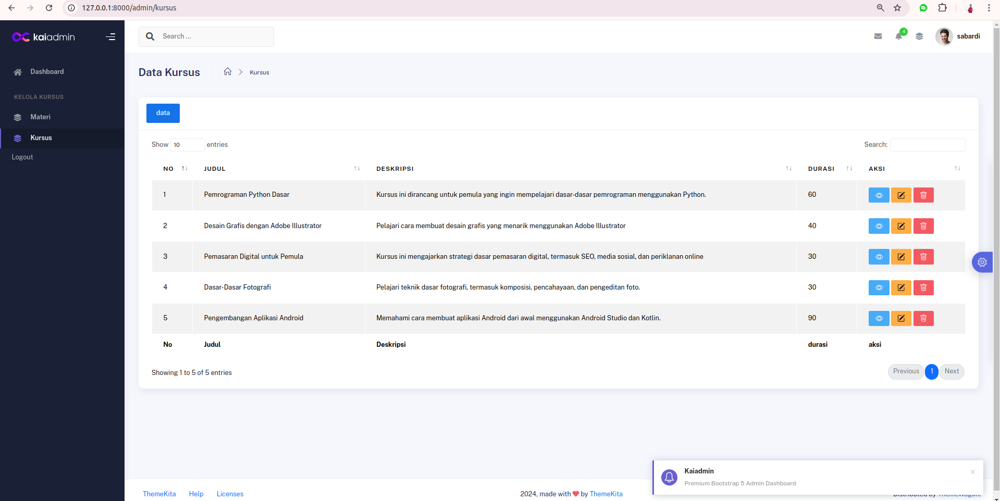
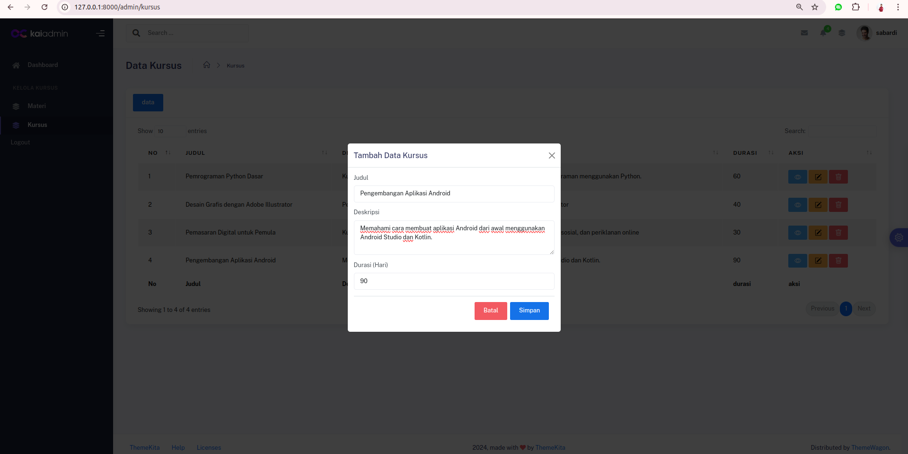
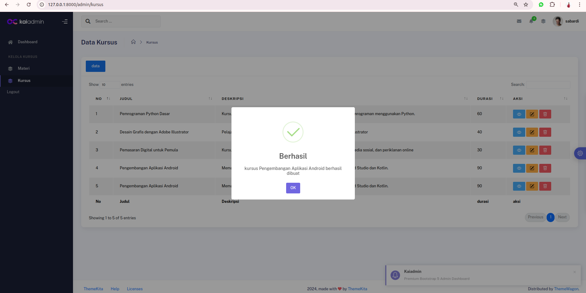
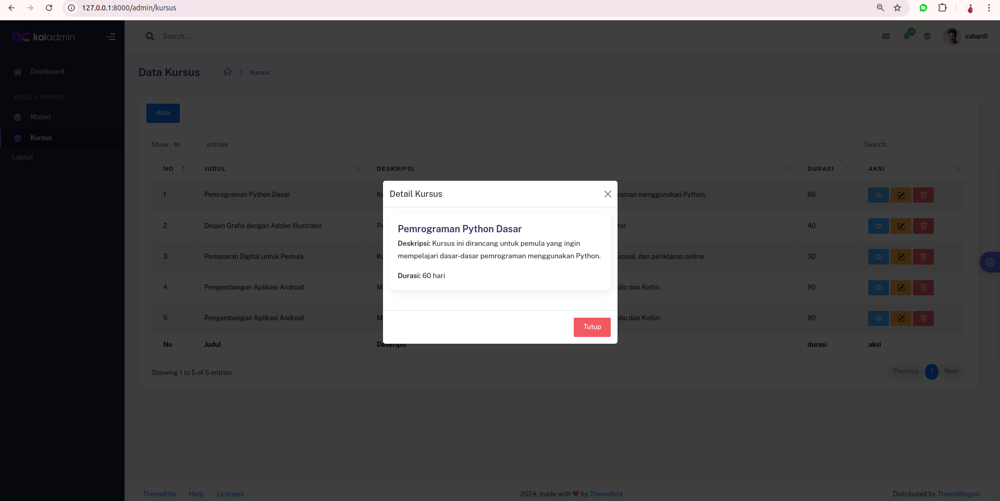
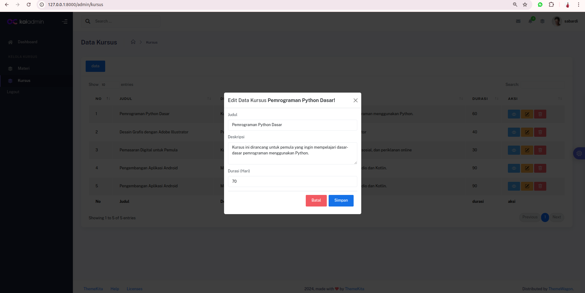
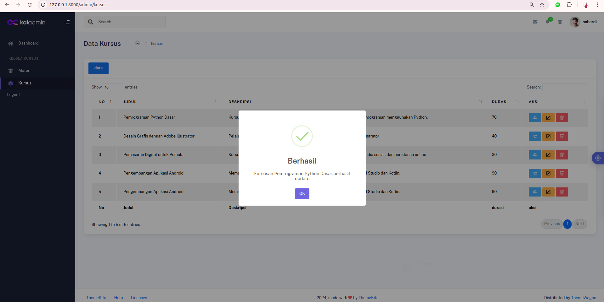
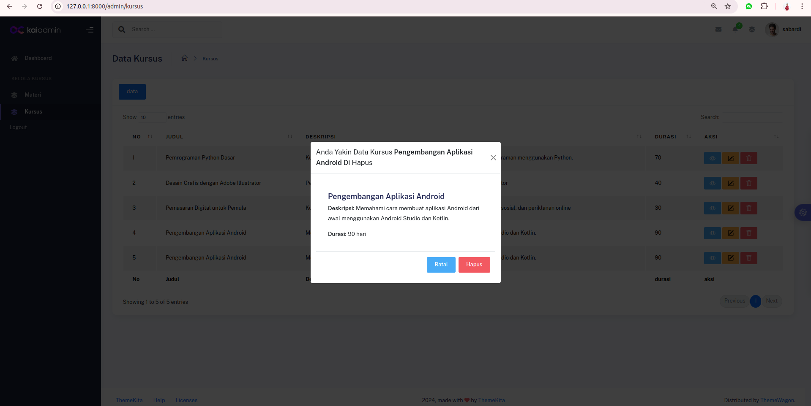
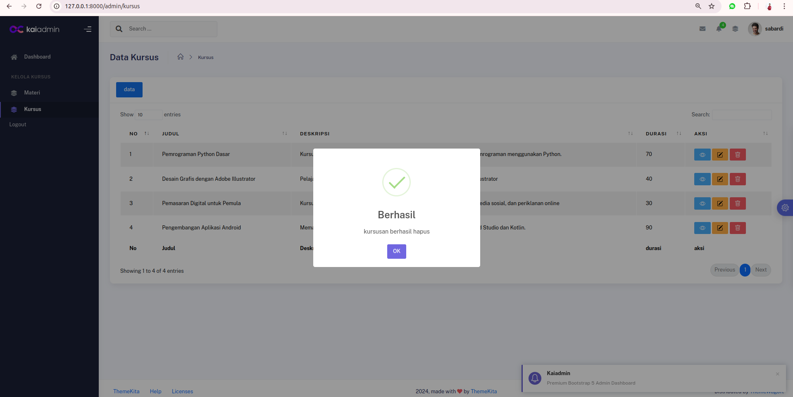

Soal test magang mbkm kampus merdeka di pt  YHC QuIP


## langkah langkah

Sebelum menjalankan proyek ini, pastikan Anda telah mengikuti langkah di bawah ini:

## Instalasi

Berikut adalah langkah-langkah untuk menginstal dan mengatur proyek ini di lingkungan lokal Anda.

1. **Clone repository** ini ke mesin lokal Anda:

   ```bash
   git clone https://github.com/Sabardi/web-kursusan.git

   cd web-kursusan

   composer install

   cp .env.example .env

   php artisan key:generate
   
   php artisan migrate 

   php artisan serve


2. **tampilan website**

## kursus










## materi


